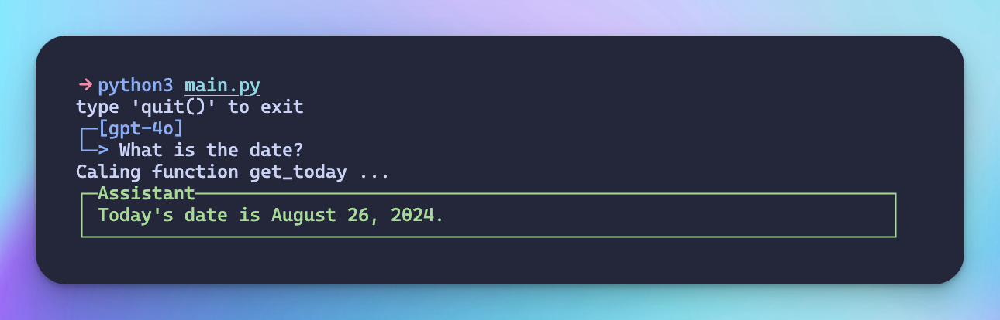
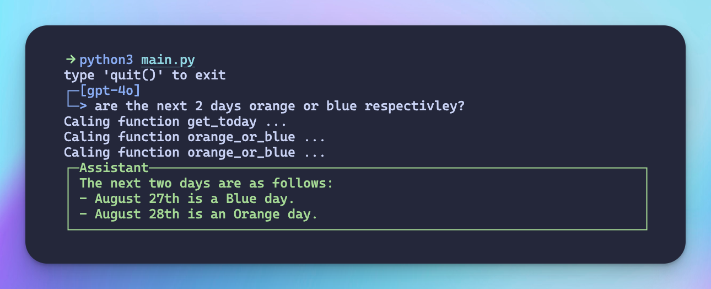

### Get started

```bash
python3 main.py
```

### Declare a new ai function

To declare a new AI function, use the `@aifunc` decorator along with docstrings and type annotations. Here's an example:

```python
@aifunc
def add(a:int,b:int):
    """
    Add two numbers
    a: first number
    b: second number
    """
    return a+b
```

#### Docstring Format

The docstring for an AI function should follow this structure:

1. Brief description of the function's purpose
2. For each parameter:
   - `parameter_name`: Description of the parameter

### Chaining functions

The ai has the ability to run multiple functions and read the outputs allowing for cool applications like this:

